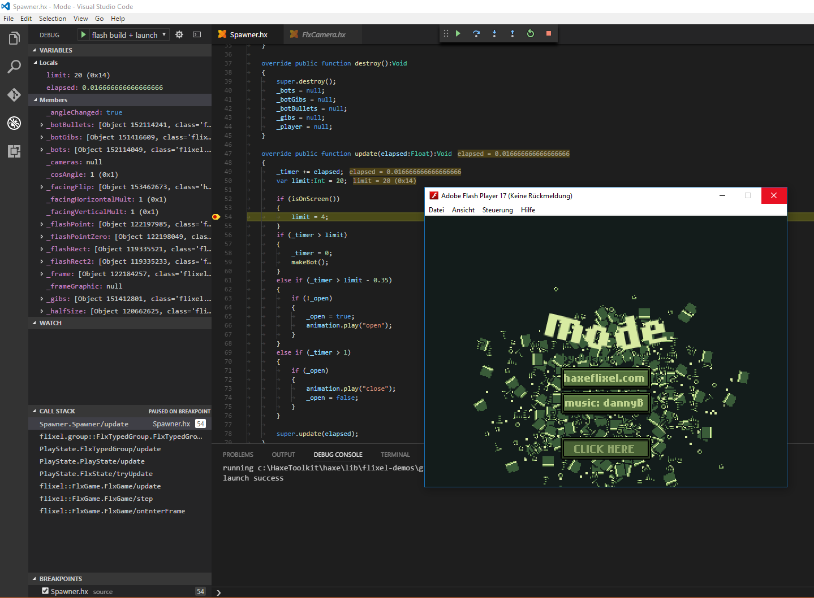
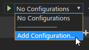

# Flash Debugger
[](https://travis-ci.org/vshaxe/flash-debugger) [](https://marketplace.visualstudio.com/items?itemName=vshaxe.haxe-debug) [](https://marketplace.visualstudio.com/items?itemName=vshaxe.haxe-debug)

This is an extension for debugging Haxe applications on the Flash target via [FDB][1]. It is best used with the [vshaxe][2] extension.



## Usage

There's three prerequisites:

1. Download the "Flash Player projector content debugger" from [here][6] and associate it with `.swf` files.
   
   On Linux, make sure the player's executable is accessible globally (for example, in the `/usr/bin/` directory or in the `PATH`) and its name is no other than `flashplayer` (you could rename the original file or [make a symlink][7] to it).
2. Make sure `JAVA_HOME` is defined **or** you have `java` in your `PATH` (to run `fdb.jar`). Please refer to these links for instructions:

   - [Setting `JAVA_HOME` on Windows][4]
   - [Setting `JAVA_HOME` on Linux][5]

3. Compile the `.swf` file you want to debug with the `-D fdb` define.

After this, you need a launch configuration. The `launch.json` should look something like this:

```json
{ 
    "version": "0.2.0",
    "configurations": [
        {
            "name": "Flash",
            "type": "fdb",
            "request": "launch",
            "program": "${workspaceRoot}/bin/application.swf"
        }
    ]
}
```

Replace `/bin/application.swf` with the path to your swf file.

You can also generate a config via `Add Configuration...` -> `Haxe (Flash)`:



## Installing from source
1. Navigate to the extensions folder (`C:\Users\<username>\.vscode\extensions` on Windows, `~/.vscode/extensions` otherwise)
2. Recursively clone this repo: `git clone --recursive https://github.com/vshaxe/flash-debugger`
3. Change current directory to the cloned one: `cd flash-debugger`.
4. Do `npm install`
5. Do `haxe build.hxml`

   [1]: http://help.adobe.com/en_US/flex/using/WS2db454920e96a9e51e63e3d11c0bf69084-7ffb.html
   [2]: https://marketplace.visualstudio.com/items?itemName=nadako.vshaxe
   [4]: http://stackoverflow.com/a/6521412/2631715
   [5]: http://askubuntu.com/a/175547/463815
   [6]: http://www.adobe.com/support/flashplayer/debug_downloads.html
   [7]: http://stackoverflow.com/questions/1951742/how-to-symlink-a-file-in-linux#answer-1951752
